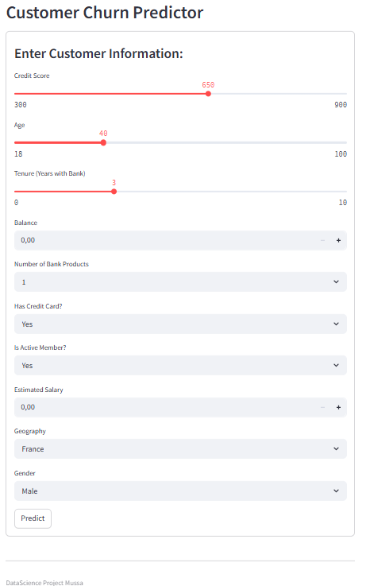

# 💼 Customer Churn Prediction Dashboard

This project aims to predict customer churn for a bank using machine learning. It walks through a complete pipeline, from data analysis to model training and deployment, ending with an interactive web dashboard.

🔗 **[Click here to view the live dashboard](https://datascienceprojects-customerchurnpredictor.streamlit.app)**


## Project Summary

The goal of this project is to identify which bank customers are likely to leave (churn), using machine learning. This helps the bank understand churn behaviour and improve customer retention.

We used a real-world dataset and followed these steps:

1. **Data Cleaning and Exploration** – Analysed patterns related to age, account activity, geography, and product usage.
2. **Feature Engineering** – Created meaningful features like `EngagedCustomer` and `AgeGroup`.
3. **Model Training** – Trained and compared Logistic Regression and XGBoost models.
4. **Model Evaluation** – Selected XGBoost for its stronger recall and ROC-AUC performance.
5. **Dashboard Deployment** – Built a Streamlit app for visual insights and live prediction.


## Live Dashboard

You can explore the dashboard here:  
👉 [https://datascienceprojects-customerchurnpredictor.streamlit.app](https://datascienceprojects-customerchurnpredictor.streamlit.app)

### Key Features:
- 📊 Churn analysis by age group, geography, products, and engagement
- 🎚️ Interactive filters (Gender and Geography)
- 🔮 Live prediction form for new customers


## Dashboard Screenshot


## Churn Predictor App


## Running Project Locally
You can run this project on your local machine by following these steps:

```bash
# 1. Clone the repository
git clone https://github.com/yourusername/Data_Science_Projects.git

# 2. Navigate to the churn project folder
cd Data_Science_Projects/customer_churn_prediction

# 3. Install dependencies
pip install -r requirements.txt

# 4. Launch the dashboard
streamlit run churn_dashboard.py

